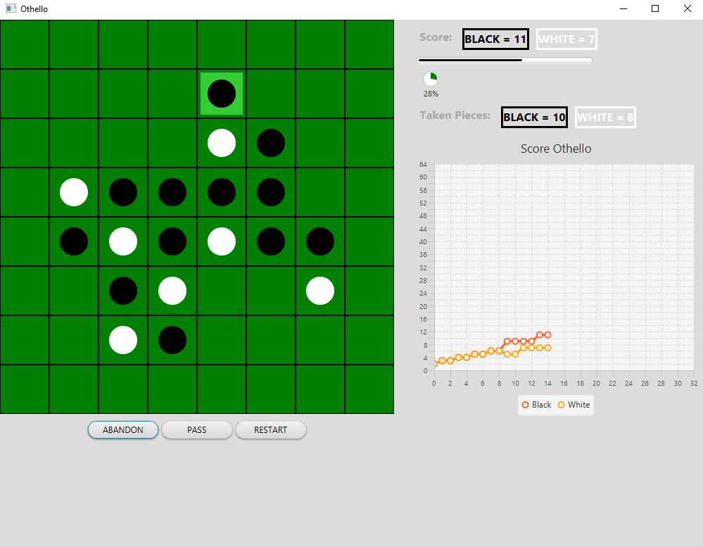

# Othello/Reversi Game

Old Project that I had to do during my studies. Replicates the Othello also known as Reversi game. It consists of a 8x8 square board, and pieces with one black and one white side. Each player has a color, and the aim of the game is to get more of your pieces on the board than the opponent's pieces.

IA play a random position from the possible moves
Additionnal features like Linechart etc were used just to experiment different JavaFX components



## Tools

* Java
* Maven
* JavaFX

## Run

In the root folder run:

```console
mvn javafx:run
```

or

```console
mvn package
java -jar target/othello-1.0.0-shaded.jar
```
